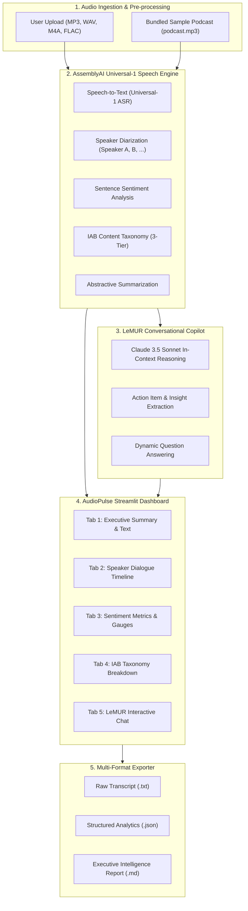

# AudioPulse 🎙️ — Speech Intelligence & Audio Analysis Suite

[](https://www.python.org/downloads/)
[](https://streamlit.io/)
[](https://www.assemblyai.com/)
[](https://www.assemblyai.com/docs/lemur)
[](tests/)
[](LICENSE)

> **AudioPulse** is a production-grade speech intelligence platform built with **Streamlit** and **AssemblyAI**. It ingests speech recordings (podcasts, customer calls, meetings), generates high-precision transcripts using the 12.5M-hour trained **Universal-1 ASR** model, diarizes multi-speaker dialogues, quantifies sentence-level sentiment, classifies content across the **IAB 3-Tier taxonomy**, and enables natural language reasoning over audio via **LeMUR (Claude 3.5 Sonnet)**.

---

## ⚡ Instant One-Click Demo (Zero Credentials Required)

Recruiters and evaluators can experience the full platform **without creating an AssemblyAI account or entering an API key**:

1. Launch the app (`streamlit run streamlit_app.py`).
2. Click **🚀 Load Sample Podcast (One-Click Demo)** in the sidebar.
3. AudioPulse instantly mounts the bundled `podcast.mp3` and loads pre-computed intelligence across all 5 dashboard tabs and conversational LeMUR Q&A!

---

## 🏗️ System Architecture



---

## 🌟 Key Features

| Feature | Description | Technical Implementation |
| :--- | :--- | :--- |
| 🗣️ **Universal-1 ASR** | State-of-the-art multilingual speech-to-text with auto-punctuated timestamps. | `aai.Transcriber().transcribe()` |
| 👥 **Speaker Diarization** | Resolves overlapping speakers and attributes timestamps to individual speakers. | `speaker_labels=True`, `speakers_expected=N` |
| 📈 **Sentiment Scoring** | Classifies sentiment per sentence (Positive, Neutral, Negative) with distribution metrics. | `sentiment_analysis=True`, `calculate_sentiment_stats()` |
| 🏷️ **IAB Taxonomy** | Maps conversations against 698+ standardized IAB content categories with relevance scores. | `iab_categories=True` |
| 📋 **Abstractive Summary** | Distills key discussion points into concise executive summaries. | `summarization=True` |
| 🧠 **LeMUR AI Copilot** | Natural language reasoning directly over conversational transcripts without custom RAG pipelines. | `transcript.lemur.task(model=claude3_5_sonnet)` |
| 📥 **Export Center** | One-click downloads for raw transcripts, structured JSON schemas, and formatted Markdown reports. | `src.audiopulse.exporter` |

---

## 📊 Transcription & Audio Intelligence Model

AudioPulse configures AssemblyAI's multi-task intelligence pipeline in a single API pass:


### Core Configuration Snippet

```python
import assemblyai as aai

config = aai.TranscriptionConfig(
    speaker_labels=True,        # Distinguish Speaker A, B, C...
    speakers_expected=2,        # Target speaker clustering
    iab_categories=True,        # Tiered content classification
    sentiment_analysis=True,    # Sentence-level sentiment polarity
    summarization=True,         # Executive abstractive summary
    language_detection=True     # Auto-detect English, Spanish, German, etc.
)

transcriber = aai.Transcriber()
transcript = transcriber.transcribe("meeting_recording.mp3", config=config)
```

---

## 📈 Speech Recognition Benchmarks

AssemblyAI's **Universal-1** model is trained on 12.5M hours of audio and sets industry-leading benchmarks for accuracy and hallucination resistance:


### Benchmark Highlights

- **Accuracy Improvement:** Achieves over **10% lower Word Error Rate (WER)** across English, Spanish, German, and French compared to traditional baselines.
- **Hallucination Reduction:** Delivers a **30% reduction in hallucination rates** during background noise and silence compared to OpenAI Whisper Large-v3.
- **Multilingual Code-Switching:** Seamlessly tracks multiple languages and accents within a single audio file.

---

## 📂 Project Structure

```
Project-Building-an-All-in-One-Audio-Analysis-App-Using-AssemblyAI/
│
├── src/
│   └── audiopulse/                 # Core modular package
│       ├── __init__.py             # Public package exports
│       ├── config.py               # Pydantic configuration & env resolution
│       ├── transcriber.py          # Universal-1 ASR engine & sentiment stats
│       ├── lemur_agent.py          # LeMUR conversational reasoning agent
│       ├── exporter.py             # JSON serialization & Markdown report engine
│       └── mock_data.py            # Pre-computed high-fidelity offline sample data
│
├── tests/                          # Automated Pytest suite (18 tests)
│   ├── test_config.py              # Configuration & env key resolution tests
│   ├── test_transcriber.py         # Timestamp conversions & sentiment calculators
│   ├── test_mock_data.py           # Sample podcast dataset validation
│   ├── test_lemur.py               # LeMUR question answering assertions
│   └── test_exporter.py            # Serialized JSON & Markdown report validation
│
├── streamlit_app.py                # Modern 5-tab Streamlit dashboard
├── podcast.mp3                     # 9.8 MB bundled audio for instant testing
├── transcription-config.jpg        # Architecture & intelligence diagram
├── a-departing-note.jpg            # WER benchmark comparison chart
├── requirements.txt                # Production dependencies
├── .env.example                    # Environment key template
├── .gitignore                      # Python & Streamlit hygiene
├── LICENSE                         # MIT License
└── README.md                       # Comprehensive documentation
```

---

## 🚀 Quick Start Guide

### 1. Prerequisites

- Python 3.10 or higher installed on your machine.
- (Optional) Free [AssemblyAI API Key](https://www.assemblyai.com/) (includes free credits).

### 2. Installation

```bash
# Clone the repository
git clone https://github.com/your-username/AudioPulse.git
cd AudioPulse

# Create and activate virtual environment
python -m venv venv
source venv/bin/activate       # On Linux/macOS
# or: .\venv\Scripts\Activate.ps1 # On Windows

# Install dependencies
pip install -r requirements.txt
```

### 3. Configure API Key (Optional for Demo Mode)

Create a `.env` file from `.env.example`:

```bash
cp .env.example .env
```

Add your AssemblyAI API key:

```ini
ASSEMBLYAI_API_KEY=your_assemblyai_api_key_here
```

*(Alternatively, enter your key directly inside the Streamlit sidebar at runtime).*

### 4. Run the Streamlit Application

```bash
streamlit run streamlit_app.py
```

Open your browser at `http://localhost:8501`.

---

## 🧪 Running the Test Suite

AudioPulse maintains a comprehensive test suite covering all core functions:

```bash
python -m pytest tests/ -v
```

Expected output:

```
============================= test session starts =============================
platform win32 -- Python 3.14.7, pytest-9.1.1, pluggy-1.6.0
collected 18 items

tests/test_config.py::test_default_config PASSED                         [  5%]
tests/test_config.py::test_custom_config PASSED                          [ 11%]
tests/test_config.py::test_get_api_key_from_env PASSED                   [ 16%]
tests/test_config.py::test_get_api_key_fallback PASSED                   [ 22%]
tests/test_exporter.py::test_transcript_to_dict PASSED                   [ 27%]
tests/test_exporter.py::test_generate_markdown_report PASSED             [ 33%]
tests/test_lemur.py::test_query_lemur_empty_prompt PASSED                [ 38%]
tests/test_lemur.py::test_query_lemur_summary_prompt PASSED              [ 44%]
tests/test_lemur.py::test_query_lemur_sentiment_prompt PASSED            [ 50%]
tests/test_lemur.py::test_query_lemur_none_transcript PASSED             [ 55%]
tests/test_mock_data.py::test_mock_transcript_properties PASSED          [ 61%]
tests/test_mock_data.py::test_mock_get_sentences PASSED                  [ 66%]
tests/test_transcriber.py::test_timestamp_string_zero PASSED             [ 72%]
tests/test_transcriber.py::test_timestamp_string_minutes PASSED          [ 77%]
tests/test_transcriber.py::test_timestamp_string_hours PASSED            [ 83%]
tests/test_transcriber.py::test_calculate_sentiment_stats_empty PASSED   [ 88%]
tests/test_transcriber.py::test_calculate_sentiment_stats_breakdown PASSED [ 94%]
tests/test_transcriber.py::test_transcribe_audio_force_mock PASSED       [100%]

============================= 18 passed in 0.11s ==============================
```

---

## 💡 Suggested Repository Rename

For improved resume visibility and portfolio presentation:

- **Current Name:** `Project-Building-an-All-in-One-Audio-Analysis-App-Using-AssemblyAI`
- **Recommended Name:** `AudioPulse` or `audiopulse-speech-intelligence`

---

## 📄 License

This project is licensed under the [MIT License](LICENSE).
